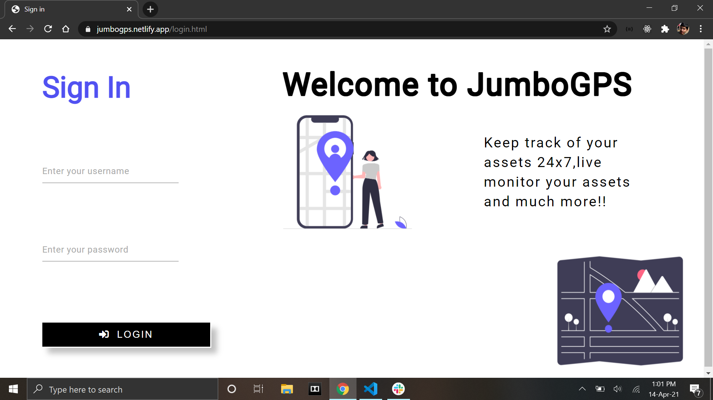
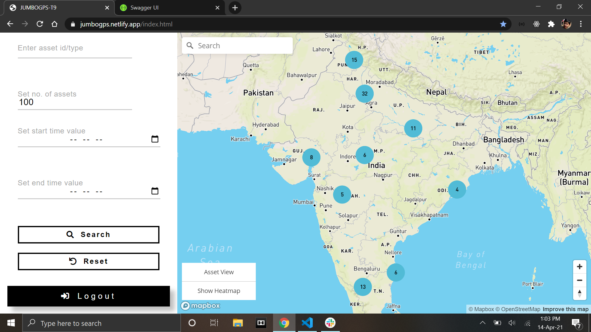
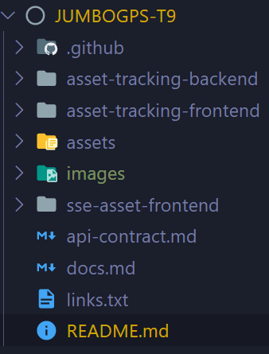

# JumboGPS App
> A GPS based asset tracking application for live monitoring your assets 24x7

## Table of contents
* [General info](#general-info)

* [Screenshots](#screenshots)

* [Tech Stack](#Tech-Stack)

* [Setup](#setup)

* [Structure](#structure)

* [Features](#features)

* [API Documentation](#API-Documentation)

* [Demo](#demo)

## Tech Stack

**Frontend**: HTML,CSS,Vanilla JS

**Backend**: Springboot,Postgres,Postgis

## Screenshots
The Project contains mainly two pages.viz.

### Authentication
This is the sign in page for the admin.



### Map Dashboard
This is where you can view all/particular asset/assets present in the database.


## Setup
To run this on your local machine,simply clone the repo and **"cd"** into the **"asset-tracking-backend"** directory:

Then run the following command:

```
mvn spring-boot:run
```

This will make the backend up and running.Now open the **"login.html"** present under **"sse-asset-frontend"** directory.

yaay! project setup is complete...you can try out all the functionalities now!😊

## Structure
The project has the following structure:



**asset-tracking-backend**

Contains all backend logic of the application.

**sse-asset-frontend**

Contains all frontend logic of the application.

## Features
List of features implemented and listed for further enhancements...

* **Search assets based on their type/id**

* **limit no. of assets shown**

* **Search assets within a particular time span**

* **24 hours timeline view of an asset**

* **Get instant notification in case of route deviation by an asset**


### Further Enhancements:

* **Native Apps for Better Experience on SmartPhones**

* **Third Party OAuth login**

* **Configurable Auto-Refresh Timer for periodic refreshment of current view**

* **Tabular View to show all assets present in database**

## API Documentation

https://jumbogps-main.anugrahsinghal.repl.co/swagger-ui.html

## Demo

https://jumbogps.netlify.app/login.html

- Use username - `anu` and password - `string` to test out the deployed site

- Video Demo https://tinyurl.com/anugrah-cwod