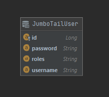
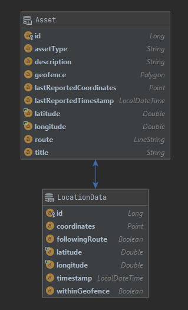

[comment]: <> (![image]&#40;https://learn.crio.do/static/media/crio-head.440aa3b7.svg&#41;   )

[comment]: <> ([crio.do]&#40;https://learn.crio.do&#41;)
## Design Document

#### This document will be used to pen-down decisions that were made while creating the project. It can be used as a future reference and/or validate decisions.

---

### Tech Stack

Backend - Java/Spring   
Database - Postgres with Postgis Extension    
Frontend - HTML CSS JS

---

### API Contracts - P0

|Endpoint|Description|Param Description|
|---|---|---|
|/assets&limit={N}|Returns the latest [N] assets where N=100 by default|`N` = number of assets to retreive
|/assets?type={assetType}&limit={N}|Returns the latest [N] assets with assetType e.g. TRUCK and  N=100 by default|`N` = number of assets to retreive   `assetType` = Type of asset eg(TRUCK or SALESPERSON)
|/assets?type={assetType}&startTimeStamp={timestamp}&endTimeStamp={timestamp}&limit={N}|Returns the latest [N] assets with assetType e.g. TRUCK and time filter say between 1-Jan-2020 3:00 PM to 2-Jan-2020 3:00 PM and N=100 by default|`N` = number of assets to retreive   `assetType` = Type of asset eg(TRUCK or SALESPERSON)   `startTimeStamp` = Starting timestamp in UTC - 0 is epoch time at January 1, 1970 12:00:00 AM   `endTimeStamp` = Ending timestamp in UTC - 1609459200 is epoch time at January 1, 2021 12:00:00 AM
|/assets?startTimeStamp={timestamp}&endTimeStamp={timestamp}&limit={N}|Returns the latest [N] assets with time filter say between 1-Jan-2020 3:00 PM to 2-Jan-2020 3:00 PM and N=100 by default|`N` = number of assets to retreive   `startTimeStamp` = Starting timestamp in UTC - 0 is epoch time at January 1, 1970 12:00:00 AM   `endTimeStamp` = Ending timestamp in UTC - 1609459200 is epoch time at January 1, 2021 12:00:00 AM
|/assets/{assetId}/history|Returns 24 Hour historical locations for an asset|`assetId` = id of the asset to be retrieved
|/assets/{assetId}|Returns just the data of a single asset|`assetId` = id of the asset to be retrieved

[Click here for More info on the APIs](https://jumbogps.anugrahsinghal.repl.co/swagger-ui.html)

---

### ER Diagram

  
 

---

### Using SQL vs NoSQL

1. The data we receive from the devices i.e. GPS data has a defined format SQL seems like a good option.
1. Some operations like getting historical data for asset will also be easily accomplished by using SQL queries, and we can maintain proper indexes on
   columns like timestamp for such queries.
    1. Using a time-series optimized DB structure would definitely be a better approach, but will take a longer time get used to due to
       non-familiarity. We can maybe take that up as a future enhancement.
1. A major reason for using SQL over NoSQL DB for this project is the familiarity with SQL.

We have chosen to use Postgres with Postgis Extension for this project.

---

### Data From Devices

2 approaches can be used for the time-stamp data of devices

1. Let the device/asset transmit the timestamp
1. Let the backend generate timestamp when it gets the location update from the Device

#### Scenario

An asset sends an update, but the network fails to deliver as asset is in transit and poor network conditions Asset keeps retrying and data transmits
after say 2 hours then the timestamp data is technically incorrect now  
BUT  
if asset timestamp is not generated at Backend. a malicious device can transmit wrong timestamps

After discussions with mentors and peers, it was decided that it was better to let the device transmit the timestamp.  
The security aspect can be taken care of on the asset/device itself to make it secure.

---

### Defining Asset Types

1. Pre-Defined Asset Types
1. Keep Asset Types Undefined, as text inputs from user/device

#### Pre-Defined Asset Types:

1. PROS
    1. Can Provide autocompletion/dropdown while searching/filtering for asset type, this makes for a better UX.
    1. DB queries can be optimized/indexed. Defining an ENUM in postgres and indexing the ENUM column will fetch results way faster than
       text-matching.
    1. Validations can be added on the backend to discard requests with wrong input values.
1. CONS:
    1. Asset can be of many types and as more and more assets are added that will also require back-end changes.

#### Keep Asset Types Undefined

1. PROS:
    1. Asset types can be dynamically increased with no intervention from the backend.
1. CONS:
    1. Slower Queries as data will be found using text-matching.
        1. Using indexes this might not be that big of a performance hit.
    1. To Provide Auto-complete functionality to the user for asset type based filter, an additional API call will be needed to fetch all possible
       input values for that type.

**Conclusion**  
After discussion with mentors and collecting their views I have decided to go with option 1 and keep my types as text-based / Undefined.   
We can change it at a later point.

---

## Requirements

1. ### Support for time based filters which will take start date/time and end date/time as inputs.

   This requirement does not clearly state that if the time based filter is needed for a single asset or asset-map as a whole.  
   After discussions with mentors, it was decided that this requirement needs to be implemented for the map as a whole.    
   **Conclusion**  
   When filtered based on `start date/time and end date/time`, the backend will return assets whose latest location were updated between the given
   `time-range`.

1. ### Show a map on which markers show the latest locations of all assets.
   All asset api's return a calculated centroid, so the map is always centered around the received data.

---

### P1 - Authentication

1. We will be using a JWT token for Authentication and Authorization

   |Endpoint|Description|Param Description|Access
      |---|---|---|---|
   |/authenticate|Takes in username and password and returns a JWT token|{"username":"abc","password":"def"}|Public Access

[Click here for More info on the APIs with Authentication](https://jumbogps-auth.anugrahsinghal.repl.co/swagger-ui.html)

---

### P1 - GeoFence

1. Will be taking the GeoFence as an array of Co-ordinates and treated as a Polygon Geometry Data Structure
2. The GeoFence will be stored with the Asset
3. Local Caching of the GeoFence data will be maintained to reduce Processing time
4. Each time the location of Asset is updated, it will be validated if the latest location lies in the geofence or not

---

### P1 - Anomaly Detection

1. Will be taking the Route as an array of Co-ordinates and treated as a LineString Geometry Data Structure
2. The Route will be stored with the Asset
3. Local Caching of the Route data will be maintained to reduce Processing time
4. Each time the location of Asset is updated, it will be validated if the latest location follows the route or not

---

### P1 - Generating Location Data For Pattern Analysis

1. For Each Asset Id we will provide the data as follows

   |Asset Id|Start Timestamp(Epoch)|Start Timestamp(Epoch)|Start Location (Coordinates)| Start Location (Coordinates)|Defined Route|GeoFence|
   |---|---|---|---|---|---|---|
   |1000|1609459200|1609559200|[70.0, 80.0]|[75.0, 82.0]|[ [75.0, 82.0],[75.0, 82.0],[75.0, 82.0],[75.0, 82.0] ]|[ [75.0, 82.0],[75.0, 82.0],[75.0,82.0],[75.0, 82.0] ]|

---
